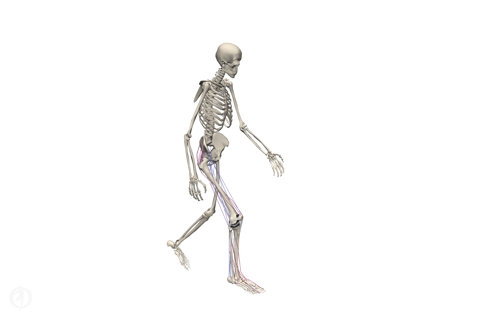
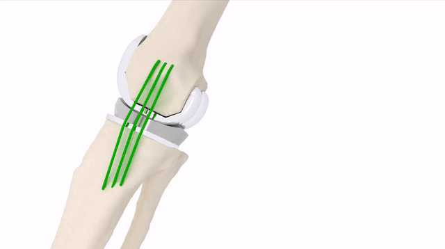
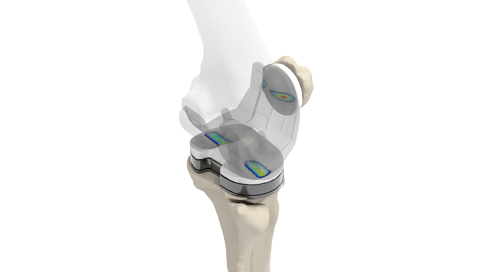
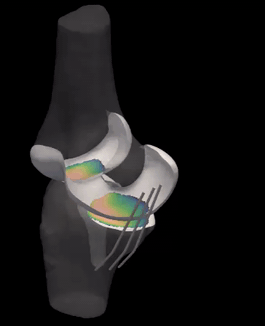
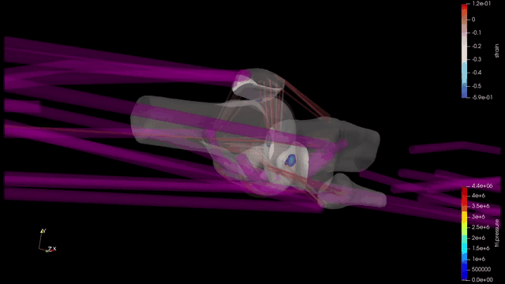

# OpenSim-JAM


_A framework to simulate **J**oint and **A**rticular **M**echanics in OpenSim._

_Author: Colin Smith_

## Overview
OpenSim JAM is a collection of force component plugins, models, and executables (tools) designed to enable OpenSim musculoskeletal simulations that include 6 degree of freedom joint mechanics with explicit representations of articular contact and ligament structures. A series of [examples](#examples) are available to demonstrate how to use these fools to perform forward simulations of joint mechanics, and simulate walking using the Concurrent Optimization of Muscle Activations and Kinematics (COMAK) algorithm. The new OpenSim Components, models, and simulation tools are described below: 

## Components
### Blankevoort1991Ligament
This one dimensional path geometry acts as a spring-damper to represent ligament fibers. The force strain relationship includes a nonlinear toe region at low strains and a linear region at high strains to represent the uncrimping and stretching of collagen fibers within a ligament. 

_Source_
- [Blankevoort1991Ligament.h](../src/Blankevoort1991Ligament.h)
- [Blankevoort1991Ligament.cpp](../src/Blankevoort1991Ligament.cpp)

_Description_
- [Blakevoort1991Ligament Description](./documentation/doxygen/Blakevoort1991Ligament_doxygen.pdf)


### Smith2018ArticularContactForce and Smith2018ContactMesh
This force component represents articular contact between cartilage, mensici, or artifical components using triangular mesh representations of the surface geometries and an elastic foundation model to compute local contact pressures.

_Source_
- [Smith2018ArticularContactForce.h](../src/Smith2018ArticularContactForce.h) 
- [Smith2018ArticularContactForce.cpp](../src/Smith2018ArticularContactForce.cpp)
- [Smith2018ContactMesh.h](../src/Smith2018ContactMesh.h)
- [Smith2018ContactMesh.cpp](../src/Smith2018ContactMesh.cpp)

_Description_  
- [Smith2018ArticularContactForce Description](./documentation/doxygen/Smith2018ArticularContactForce_doxygen.pdf) 
- [Smith2018ContactMesh Description](./documentation/doxygen/Smith2018ContactMesh_doxygen.pdf).

## Models
### [Lenhart2015 Model](./models/lenhart2015)
*Lenhart, R. L., Kaiser, J., Smith, C. R., & Thelen, D. G. (2015). Prediction and validation of load-dependent behavior of the tibiofemoral and patellofemoral joints during movement. Annals of biomedical engineering, 43(11), 2675-2685*

<p align="center">
   
</p>

The Lenhart2015 model is an OpenSim implementation of the model described in the paper above. A multibody knee model was constructed based on magnetic resonance images from a healthy young adult female. The bones, ligaments, and cartilage were segmented from different image sets that were optimized for the discerning the relavent structures and registered together. The lenhart2015 model includes the tibiofemoral and patellofemoral joints as 6 DOF joints. Tibiofemoral and patellofemoral articular contact are represented using Smith2018SmithArticularContactForce components and damping is represented using SpringGeneralizedForce components acting on each knee coodinate. Knee ligaments and passive structures are represented using bundles of Blankevoort1991Ligaments. See publication for further details of model construction. 

## Simulation Tools
### Forsim 
The ForsimTool enables forward dynamic simulations of joint mechanics to be performed. Practically, this allows simulations of cadaver experiments, passive clinical examinations, and simulations where the muscle forces or excitations are known inputs. Fundamentally, it is similar to the ForwardTool in the OpenSim GUI, but the interface is designed for performing forward simulations involving articular contact. The input files can define the muscle and actuator controls (excitations), activations, or forces vs time, external loads applied to the model, and the Coordinate values vs time for Prescribed Coordinates. The forsim tool uses an implicit integrator (SimTK::CPODES::BDF), which gives far superior performance for simulations that involve contact compared to the explicit integrators used by the existing OpenSim ForwardTool. 

_Source_
- [ForsimTool.h](../src/ForsimTool.h)
- [ForsimTool.cpp](../src/ForsimTool.cpp)

_Description_
- [Smith2018ArticularContactForce Description](./documentation/doxygen/ForsimTool_doxygen.pdf)

### COMAKInverseKinematics and COMAK
The **C**oncurrent **O**ptimization of **M**uscle **A**ctivations and **K**inematics (COMAK) algorithm enables the calculation of muscle forces and detailed joint mechanics during dynamic movements. 

_Source_
- [COMAKInverseKinematicsTool.h](../src/COMAKInverseKinematicsTool.h)
- [COMAKInverseKinematicsTool.cpp](../src/COMAKInverseKinematicsTool.cpp)
- [COMAKTool.h](../src/COMAKTool.h)
- [COMAKTool.cpp](../src/COMAKTool.cpp)

_Description_
- [COMAKInverseKinematicsTool Description](./documentation/doxygen/COMAKInverseKinematicsTool_doxygen.pdf)
- [COMAKTool Description](./documentation/doxygen/COMAKTool_doxygen.pdf)

### Joint Mechanics
The JointMechanicsTool enables detailed post-hoc analysis of simulations or measurments of joint mechanics. It can be used to generate .vtp files to visualize simulation results in Paraview, or .h5 files which are binary files that can store the large quantites of contact data (multiple calculated values for each triange face) in compact files that can be quickly read by MATLAB, Python, or [HDF View](https://www.hdfgroup.org/downloads/hdfview/)

_Source_
- [JointMechanicsTool.h](../src/JointMechanicsTool.h)
- [JointMechanicsTool.cpp](../src/JointMechanicsTool.cpp)

_Description_
- [JointMechanicsTool Description](./documentation/doxygen/JointMechanicsToolTool_doxygen.pdf)

## Distribution
### OpenSim-JAM Plugin
An OpenSim Plugin containing the OpenSim-JAM Components and Tools has been compiled for Windows and OpenSim 4.0 using Visual Studio 15 2017 Win64. The plugin file is located at [./bin/jam-plugin.dll](./bin/jam-plugin.dll) For linux or mac users, you must compile the plugin yourself. 

The plugin can be used with the OpenSim 4.0 GUI, MATLAB/Python, and commmand line interfaces ([instructions](https://simtk-confluence.stanford.edu/display/OpenSim/Using+Plugins)).

### Executables 
Each of the [Simulation Tools](#simulation-tools) have been compiled as command line executables (.exe) for windows. This allows users to define simulation settings in a .xml file and organize and perform simulations using windows .cmd files. The compiled executable files are located at [bin](./bin) and the c++ source code is located at [cmd_tools](../src/cmd_tools)

Each executable can be called in the windows command line using the following syntax:

```cmd
exectuable-name .\path\to\jam_plugin.dll .\path\to\settings_file.xml
```

The execuatables are dependent on the OpenSim 4.0 libraries. A copy of the necessary OpenSim .dll libraries are included in this repository [here](opensim).

Relative paths in the .xml settings files should be referenced to the location of the .xml file.

## Examples
A series of examples are provided to demonstrate the capabilities of OpenSim JAM. 

The examples use the [OpenSim 4.0 - MATLAB scripting interface](https://simtk-confluence.stanford.edu:8443/display/OpenSim/Scripting+with+Matlab) to generate the necessary input files and process the simulation results. The windows commmand line executables are used to perform the simulations. Thus, currently only windows can be used to run the examples. 


### [Visualize Kinematics](./examples/visualize_kinematics)
<p align="center">
  
</p>
The JointMechanicsTool can be used to analyze and visualize simulated or measured kinematics from fluoroscopy, dynamic MRI, etc or static poses from medical imaging. This example demonstrates how to input bone kinematics to the JointMechanicsTool and generate .vtp files to visualize proximity maps between the tibiofemoral subchondral bone surfaces using Paraview. 

### [Passive Flexion](./examples/passive_flexion)
<p align="center">
  
</p>

Perform a forward simulation of passive knee flexion where tibiofemoral flexion is prescribed and the other knee coordinates are unconstrained and thus are calculated based on the passive muscle, ligament, and articular contact forces. 

### [Anterior Laxity](./examples/anterior_laxity)
Replicate a clinical test for anterior cruciate ligament (ACL) deficiency by performing a forward simulation where the hip is flexed to 45<sup>o</sup>, the knee is flexed to 90<sup>o</sup> and an anterior force is applied to the tibia.

### [Isometric Extension](./examples/isometric_extension)
Replicate a clinical isometric extension test where the hip and knee are held at 30<sup>o</sup> flexion and the patient activates their quadriceps. 

### [Walking](./examples/walking)
Use COMAK  to predict muscle forces, ligament forces, cartilage contact pressures, and secondary knee kinematics during walking. 

## Software:
### [OpenSim 4.0 GUI](https://opensim.stanford.edu/)
The OpenSim GUI is helpful for visualizing models and simulation results. Instructions for visualizing models and simulation results are provided [here](documentation/visualizing-simulation-results.md)

### [MATLAB](https://www.mathworks.com/products/matlab.html)
MATLAB is used in the examples to generate input files and process simulation results. You will need to have the [OpenSim 4.0 - MATLAB scripting interface](https://simtk-confluence.stanford.edu:8443/display/OpenSim/Scripting+with+Matlab) setup in order to generate the example input files. [Python](https://simtk-confluence.stanford.edu:8443/display/OpenSim/Scripting+in+Python) is an open-source alternative that can also be used for this purpose, but you will need to tranlsate the MATLAB scripts. 

### Text Editor
A text editor that is capable of syntax highlighting and code folding is nice for viewing the .osim model files, as well as the .cmd scripts and .xml settings files in the examples. [Visual Studio Code](https://code.visualstudio.com/) is my personal choice at the moment, but many OpenSim users also like [Notepad++](https://notepad-plus-plus.org/).

### [Paraview](https://www.paraview.org/)
Paraview is used to for high quality rendering of simulation results, visualization of contact maps. The JointMechanicsTool provides the ability to generate .vtp files that can be directly read into Paraview. 

Instructions for visualizing simulation results are provided [here](documentation/visualizing-simulation-results.md)

### [HDFView](https://www.hdfgroup.org/downloads/hdfview/)
HDFviewer is a standalone gui to explore .h5 file contents. 

### Mesh Editing Tools
The following softwares can be helpful for constructing and editing the triangular mesh representations of the articular surfaces (.stl, .vtp, or .obj) files used in the Smith2018ContactMesh component.

#### [Mesh Mixer](http://www.meshmixer.com/) 
Software for mesh visualization, refinement, cutting, smoothing etc.

#### [Mesh Lab](http://www.meshlab.net/)
Software for mesh visualization, smoothing etc. 

#### [GIBBON](https://www.gibboncode.org/)
MATLAB based software toolkit that includes mesh editing features.


## Acknowledgements 
Much of the included models and codes were initially developed in the [UW Neuromuscular Biomechanics Lab at the University of Wisconsin-Madison](https://uwnmbl.engr.wisc.edu). Contributers to this work include Darryl Thelen, Rachel Lenhart, Jarred Kaiser, Michael Vignos, Kwang won Choi, Scott Brandon, and Josh Roth. Translation and extension of the orginal SIMM and UWPipeline into OpenSim was performed during my time as a PhD at UW-Madison (NIH EB015410) and Stanford ([NCSRR Visiting Scholar](https://opensim.stanford.edu/support/scholars.html)), and as a post-doc at the [Laboratory for Movement Biomechanics](https://www.movement.ethz.ch/) at ETH Zürich ([Whitaker International Program](https://www.whitaker.org/), [OpenSim Pilot Project](https://opensim.stanford.edu/support/pilot.html)).

A list of publications that use these tools is located [here](./documentation/references.md)
