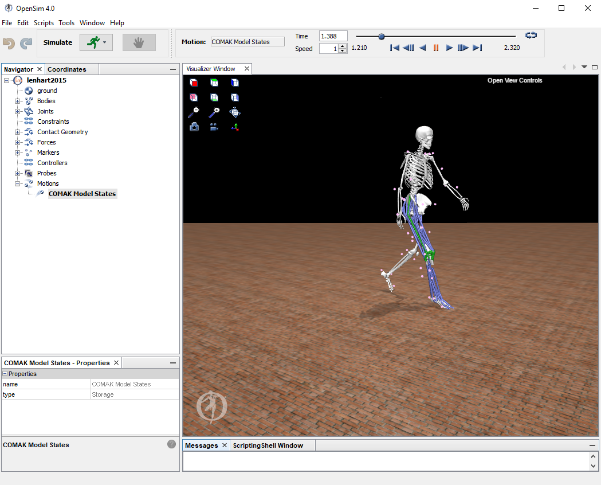
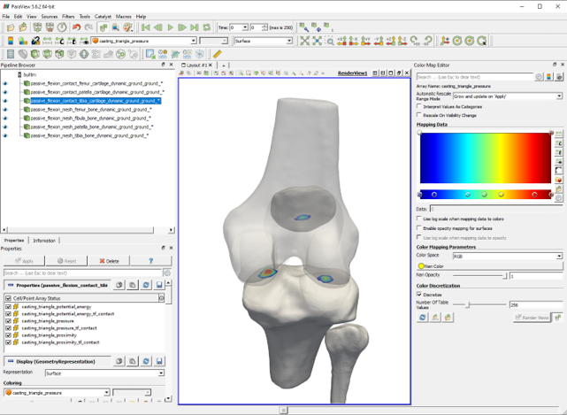

# Visualizing Models and Simulation Results

# SimTK Visualizer

  

In the .xml settings file for each of the OpenSim-Jam tools there is a <use_visualizer> property that will enable using the SimTK::Visualizer to view the model in realtime. 

# OpenSim 4.0 GUI 

  

The OpenSim GUI offers the easiest way to visualize models including OpenSim-JAM components and simulation results generated using the OpenSim-JAM tools. For an overview on using the OpenSim GUI, see [here](https://simtk-confluence.stanford.edu/display/OpenSim/Graphical+User+Interface). Currently, the Blankevoort1991Ligaments and Smith2018ContactMesh components can only be visualized in the OpenSim GUI with a constant solid color defined in the .osim file. 

### Load Plugin 
[OpenSim Documentation](https://simtk-confluence.stanford.edu/display/OpenSim/Using+Plugins)

Note: the distributed plugin can only be loaded into the OpenSim 4.0 GUI on windows. 

1) Create a folder in the OpenSim 4.0 install directory (default C:\OpenSim 4.0) named 'plugins'. Copy the [jam_plugin.dll](../bin/jam_plugin.dll) file to this location. 

2) Open the OpenSim GUI 

3) Tools -> User Plugins... -> jam_plugin.dll 

4) To automatically load the plugin every time you open the OpenSim GUI, check the 'Always load library on entry' box. Also make sure that Edit -> Perferences... -> 'Application: Resotre Models on Start Up' is set to 'On'.

### Load Model
1) File -> Open Model... -> select the .osim file
2) In the 'Navigator' window, you can find the Blankevoort1991Ligament and Smith2018ArticularContact components under MODELNAME -> Forces -> Other Forces. The Smith2018ContactMesh components can be found under MODELNAME -> Contact Geometry. 

### Load Simulation Results
1) To load the simuation kinematics, click File -> Load Motion... -> select the to .sto or .mot file. [Detailed instructions](https://simtk-confluence.stanford.edu/display/OpenSim/Loading+Motions)
2) To color the model muscles according to their activation, right click on the motion in the navigator window MODELNAME -> Motions -> MOTIONNAME -> Color Muscles From File... [Detailed Instructions](https://simtk-confluence.stanford.edu/display/OpenSim/Associating+Data+with+a+Motion)

### Plot tool
You can use the OpenSim plot tool to visualize simulation results stored in .sto or .mot files. See the OpenSim documentation for details https://simtk-confluence.stanford.edu/display/OpenSim/Plotting

# Paraview

  

[Paraview](https://www.paraview.org/) is an open-source software for designed for visualization of scientific data. [Paraview Desktop](https://www.paraview.org/desktop/) is a GUI (windows, mac, linux) that allows enables high quality visualization of OpenSim simulations. There is a significant amount of documentation and tutorials on using the Paraview GUI and Paraview python scripting to generate visualizations of scientific data on their website https://www.paraview.org/documentation/. The documentation below provides specific instructions for visualizing OpenSim-JAM simulations.   

The JointMechanicsTool can read in simulation results (.sto) and generate .vtp files that can be read into Paraview for visualizing simulation results and generating high quality renderings. See the [JointMechanicsTool description] and [examples](../examples) for details on generatiing the .vtp files. 

### Loading .vtp files
1) File -> Open... 
2) Navigate to the folder containing the series of .vtp files. Note that all .vtp files in a time-series (name_#) will be collapsed into a single name.
2) Select the series of .vtp files you want to read. You can hold down ctrl or shift to select multiple series. Press 'OK'  

### Grouping 
You can group multiple sources (.vtp files) together by selecting them in the Pipeline Browser and pressing the "Group" button. This allows you to set visualization parameters for all ligaments etc. at the same time.  

### Filters
Paraview has filters built in to post process the source data (.vtp files). To apply a filter, select a source in the Pipeline Browser, then Filters->Alphabetical from the drop down menu.

### Smith2018ArticularContact
1) Load contact_XX.vtp files 
2) Apply Filter CellToPoint to smooth the color map 
3) Select the output values to visualize using the "Change color source" field.
4) Adjust the Color Map using the "Color map editor"

### Ligaments
1) Load ligament_XX.vtp files
2) Apply Tube filter
3) Select the output values to visualize using the "Change color source" field. 
4) Adjust the Color Map using the "Color map editor"

### Muscles
1) Load muscle_XX.vtp files
2) Apply Tube filter
3) Select the output values to visualize using the "Change color source" field. 
4) Adjust the Color Map using the "Color map editor"

### Attached Geometries (bones etc)
1) Load mesh_XX.vtp files

### Saving Screenshots
1) File -> Save Screenshot...
2) Enter image file name, type, and location, press OK.
3) Enter image specification details, press OK.

### Saving Animations
1) File -> Save Animation...
2) Enter image file name, type, and location, press OK.
3) Enter image specification details, press OK.

This will save a series of images for each frame, you will need to use a video editor to combine these images into a video file. 

### Saving the Paraview State
You can use File->Save State... and File->Load State... to save the current paraview configuration (loaded .vtp files, filters, settings, etc).
