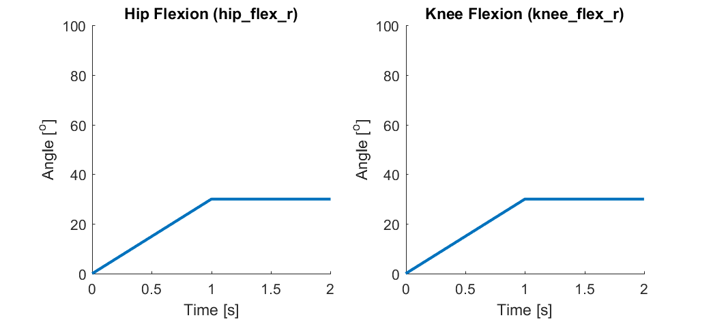
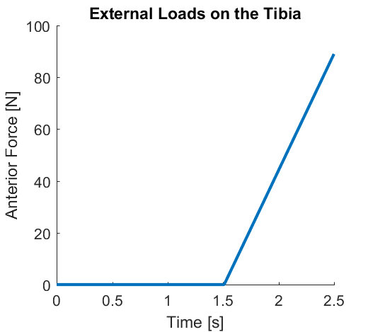
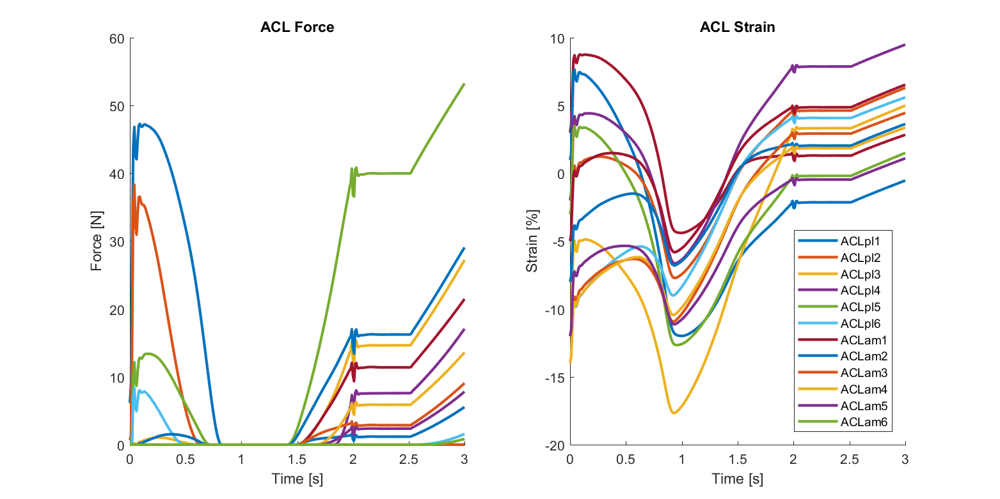
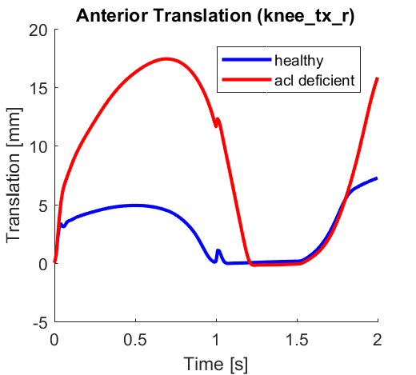

# Example: Anterior Laxity

[(https://twitter.com/healthcrib_fdt/status/971353139117948928)

This simulation replicates an anterior laxity test used to diagnose (anterior cruciate ligament) ACL injuries. In this test, a clinician manually flexes the hip to 25o and the knee to 25o and then applies an anterior force to the tibia to test for excessive laxity indicative of an ACL tear. In the example, the simulation is first performed with a healthy knee and then repeated using an ACL deficient knee so that the tibiofemoral anterior translation between the two conditions can be compared. All muscles are assumed to be minimally activated, thus the predicted knee kinematics result from the passive contributions of the muscles, ligaments, and articular contact. 

## Simulation Description
This simulation uses the [lenhart2015 model](../../models/lenhart2015/lenhart2015.osim). First, the hip_flex_r and knee_flex_r coordinates are fixed at 0o and the knee is allowed to settle into equilibrium for 0.5 seconds. Then, hip_flex_r and knee_flex_r are prescribed to flex from 0o to 25o. Once peak flexion is reached, the hip and knee flexion are prescribed to be constant at 25o. After a 0.5 second settling period, a anterior force is applied to the tibia that increases linearly from 0 to 100 N over a 1.0 second period. The muscles are minimally activated (0.02) and thus only provide passive forces. The remaining knee Coordinates aside from knee_flex_r (5 tibiofemoral DOFs and 6 patellofemoral DOFs) are unlocked and thus their kinematics are predicted as a result of the muscle, ligament, and cartilage contact forces. All other model Coordinates are locked, and thus fixed to their default values over the duration of the simulation. 

## Inputs

## Simulation Results

## Workflow Steps
1) Run the [./inputs/generate_anterior_laxity_input_files.m](inputs/generate_anterior_laxity_input_files.m) script in MATLAB to generate the necessary input files. This will write the [./inputs/prescribed_coordinates.sto](./inputs/prescribed_coordinates.sto) file which contains the hip_flex_r and knee_flex_r values vs time, the  [./inputs/external_loads.sto](./inputs/external_loads.sto) file containing the anterior force values vs time, and the [./inputs/external_loads.xml](./inputs/external_loads.xml) file describing how the anterior force is applied to the model. Additionally, it will read the [lenhart2015 model](../../models/lenhart2015/lenhart2015.osim), delete the Blankevoort1991Ligament components representing the ACL, and write the [lenhart2015_acld model file](../../models/lenhart2015/lenhart2015.osim). 

2) Inspect the [./inputs/forsim_settings.xml](inputs/forsim_settings.xml) and [./inputs/joint_mechanics_settings.xml](inputs/joint_mechanics_settings.xml) files in a text editor to understand the property settings that setup the simulations.

3) Double click on [run_anterior_laxity.cmd](run_anterior_laxity.cmd) to perform the forsim simulation and joint-mechanics analysis for the healthy and ACL deficient models using the command line. You can open this file in a text editor to understand the code format to run the forsim and joint-mechanics executables.

4) Use Paraview and/or the OpenSim GUI to visualize the simulation results [instructions](../../documentation/visualizing-simulation-results).

5) Use MATLAB to run the [./analysis/analyze_anterior_laxity.m](./analysis/analyze_anterior_laxity.m) script to generate plots of anterior translation vs time for the healthy and ACL deficient models. A plot of ACL force vs time is also generated for the healthy model.  
