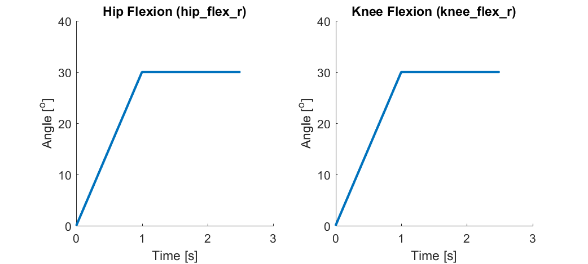
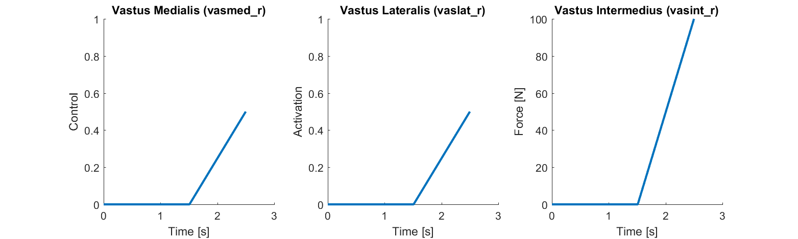
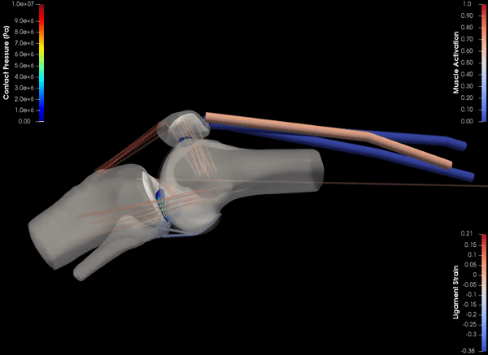

# Example: Isometric Extension

  

This example intends to replicate an isometric extension test where the hip and knee are manually flexed to 30o by a clinician. Then, the clinician holds the leg in place and the patient attempts to extend their knee by activating their quadriceps. 

## Simulation Description
This simulation uses the [lenhart2015 model](../../models/lenhart2015/lenhart2015.osim). First, the hip_flex_r and knee_flex_r are fixed at 0o and the knee is allowed to settle into equilibrium for 0.5 seconds. Then, over the next 1.0 seconds, the hip_flex_r and knee_flex_r coordinates are prescribed to flex from 0o to 30o, then they are held constant at 30o for the remainder of the simulation. The remaining knee coordinates (5 tibiofemoral and 6 patellofemoral DOFs) are unlocked, thus their kinematics are predicted as a result of the muscle, ligament, and articular contact forces. The pelvis_tilt coordinate is prescribed to be 90o throughout the simulation to replicate the patient lying on a table. Once 30o hip and knee flexion are reached, the model is allowed to settle into equilibrium for 0.5 seconds, and then the vastii are activated over a duration of 1.0 seconds. For the purpose of demonstrating the capabilities of the ForsimTool, the *control* (excitation) of the vastus medialis is increased from 0 to 0.75, the *activation* of vastus lateralis is increased from 0 to 0.75, and the *force* in the vastus intermedius is increased from 0 to 500.

## Simulation Inputs

## Simulation Results

Note: That only the vastus medialis activation can be visualized in paraview at the moment. 

## Workflow Steps
1) Run the [./inputs/generate_isometric_extension_input_files.m](inputs/generate_isometric_extension_input_files.m) script in MATLAB to generate the necessary input files. This write the [./inputs/prescribed_coordinates.sto](./inputs/prescribed_coordinates.sto) file which contains the hip_flex_r and knee_flex_r values vs time, and the [./inputs/muscle_inputs.sto](./inputs/muscle_inputs.sto) which contain the vastii controls, activations, and forces vs time. 

2) Inspect the [./inputs/forsim_settings.xml](inputs/forsim_settings.xml) and [./inputs/joint_mechanics_settings.xml](inputs/joint_mechanics_settings.xml) files in a text editor to understand the property settings that setup the simulations.

3) Double click on [run_isometric_extension.cmd](run_isometric_extension.cmd) to perform the forsim simulation and joint-mechanics analysis using the command line. You can open this file in a text editor to understand the code format to run the forsim and joint-mechanics executables.

4) Use Paraview and/or the OpenSim GUI to visualize the simulation results [instructions](../../documentation/visualizing-simulation-results).

5) Use MATLAB to run the analyze_anterior_laxity.m script to generate plots of anterior translation vs time for the healthy and ACL deficient models. A plot of ACL force vs time is also generated for the healthy model.  

