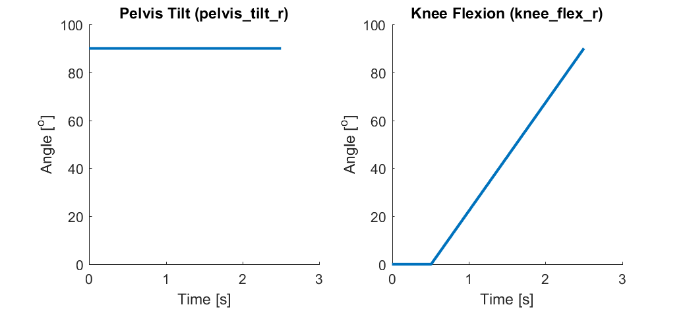

# Example: Passive Flexion

  

This example simulates passive flexion of the knee from 0o to 120o. The simulation is designed to replicate a clinician manually flexing a patient's knee or a robot manipulating a cadaver knee. Thus, the muscle activation is assumed to be minimal and only the passive muscle, ligament, and contact forces contribute to the predicted knee motion and loading. 

## Simulation Description
This simulation uses the [lenhart2015 model](../../models/lenhart2015/lenhart2015.osim). Tibiofemoral flexion (knee_flex_r) is prescribed using the [inputs/prescribed_coordinates.sto](./inputs/prescribed_coordinates.sto) file. Initially, knee_flex_r is held constant at 0o for 0.5 seconds to allow the knee to settle into equilibrium, then over the next 2.0 seconds knee_flex_r is prescribed to flex from 0o to 90o. All other knee coordinates (5 tibiofemoral DOFs and 6 patellofemoral DOFs) are unlocked and thus their kinematics over the simulation are predicted based on the passive muscle, ligament, and contact forces. The pelvis_tilt coordinate is prescribed to be 90o over the duration of the simulation to represent the patient lying on a table. The remaining coordinates in the model are locked, and thus fixed at their default values throughout the simulation. 

## Simulation Inputs

  

## Workflow steps 
1) Use MATLAB to run the [./inputs/generate_passive_flexion_input_files.m](./inputs/generate_passive_flexion_input_files.m) script to generate the [./inputs/prescribed_coordinates.sto](./inputs/prescribed_coordinate.sto) file containing the knee_flex_r and pelvis_tilt coordinate values vs time. 

2) Inspect the [./inputs/forsim_settings.xml](inputs/forsim_settings.xml) and [./inputs/joint_mechanics_settings.xml](./inputs/joint_mechanics_settings.xml) files in a text editor to understand the property settings used to setup the simulation.

3) Double click on [run_passive_flexion.cmd](run_passive_flexion.cmd) to perform the forsim simulation and joint-mechanics analysis using the command line. You can open this file in a text editor to understand the code format to run the forsim and joint-mechanics executables.

4) Use Paraview and/or the OpenSim GUI to visualize the simulation results [instructions](../../documentation/visualizing-simulation-results).
