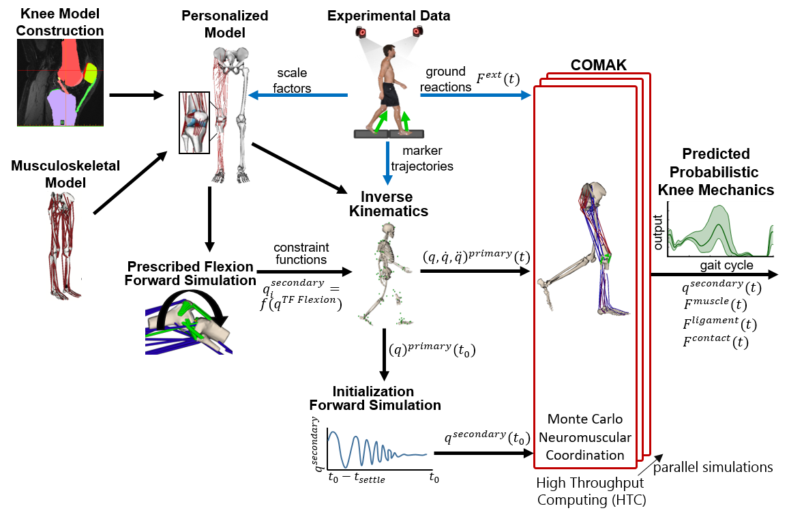

# Example: Walking

## Simulation Description

  <b>COMAK Workflow</b> 
   

  <b>COMAK Algorithm</b> 
  
   <i>Note: The complete form of the cost function is provided below. </i> 

This example uses the COMAK to predict muscle forces, ligament forces, cartilage contact pressures, and secondary knee kinematics (5 tibiofemoral DOFs, 5 patellofemoral DOFs) during walking. 

The experimental data (motion capture, ground reaction forces) were collected while the Lenhart2015 subject performed overground walking at a self selected speed. 

Within COMAK it is important to define model coordinates as Primary, Secondary, and Prescribed. The Primary and the Prescribed coordinates must be quantifable using motion capture. In the COMAK optimization, a constraint equation is included for each Primary coordinate that dictates that the simulated accelerations (resulting from the model muscle, ligament, contact, external, gravitational, inertial forces) are equal to the measured accelerations of the Primary coordinates. In simpler terms, the model must generate the measured joint moments for the Primary coordinates. The Prescribed coordinates are prescribed within the simulation, thus their accelerations are generated by multibody constraints and not by the model forces. The Secondary coordinates generally cannot be accurately measured using motion capture and thus are predicted by the COMAK optimization.     

__Primary Coordinates__
- hip_flex_r
- hip_add_r
- hip_rotation_r
- knee_flex_r
- ankle_flex_r

__Secondary Coordinates__
- knee_add_r
- knee_rot_r
- knee_tx_r
- knee_ty_r
- knee_tz_r
- pf_flex_r
- pf_rot_r
- pf_tilt_r
- pf_tx_r
- pf_ty_r
- pf_tz_r

__Prescribed Coordinates__
- All other model coordinates (pelvis, left leg, upperbody). 

__COMAKInverseKinematicsTool__

The COMAKInverseKinematicsTool is used to calculate the kinematics of the Primary and Prescribed coordinates from the motion capture data. First, the COMAKInverseKinematics tool is used to perform a passive forward simulation where the knee flexion flexes from 0o to 120o and the Seconday coordinates are predicted based on the passive muscle, ligament, and articular contact forces. These simulation results are used to generate functions that couple the Secondary coordinates to the knee_flex_r within inverse kinematics through a CoordinateCouplerConstraint. These constraints are only used in the inverse kinematics solution and are removed for the COMAK simulation.
  
__COMAKTool__

The COMAKTool is used to calculate the Secondary kinematics, as well as the muscle, ligament, and articular contact forces for the measured walking trial. The COMAK optimization minimizes the following cost function:

  <b>COMAK Cost Function</b> 
   

In this example, three simulations are performed with different cost function parameters using the same input data to demonstrate the ability to vary the optimized muscle coordination patterns and inspect the resulting knee mechanics. The three simulations are setup as follows

_comak_\
All muscle weight terms (Wi) are set to 1, and the contact energy weight (CW) is set to 0.

_comak_muscle_weights_\
All muscle weight terms (Wi) are set to 1 except those listed below, and the contact energy weight (CW) is set to 0.
- Wgasmed_r = 4
- Wgaslat_r = 7
- Wgaslat_r = 7
- Wsoleus_r = 0.9
- Wrecfem_r = 3
- Wglmed1_r = 0.9
- Wglmed2_r = 0.9
- Wglmed3_r = 0.9
- Wglmin1_r = 0.9
- Wglmin2_r = 0.9
- Wglmin3_r = 0.9
- Wbflh_r = 2
- Wbfsh_r = 2
- Wsemiten_r = 2
- Wsemimem_r = 2

_comak_contact_energy_\
All muscle weight terms (Wi) are set to 1, and the contact energy weight (CW) is set to 500.
## Simulation Results

  <b>Tibiofemoral Kinematics</b> 
    

  <b>Patellofemoral Kinematics</b> 
   

  <b>Tibia Axial Contact Force</b> 
   

  <b>Muscle Activations</b> 
   

  <b>Cartilage Contact Pressure</b> 
   

  <b>ACL and Patellar Tendon Force</b> 
   

## Workflow Steps
1) Inspect the [./inputs/comak_inverse_kinematics_settings.xml](./inputs/comak_inverse_kinematics_settings.xml), as well as the [./inputs/comak_settings.xml](./inputs/comak_settings.xml), [./inputs/comak_settings_muscle_weights.xml](./inputs/comak_settings_muscle_weights.xml), and [./inputs/comak_settings_contact_energy.xml](./inputs/comak_settings_contact_energy.xml) files to understand the inputs and settings for the simulation.

2) Double click on [run_walking.cmd](run_walking.cmd) to run the COMAKInverseKinematics, COMAKTool, and JointMechanicsTools to perform the simulation using the command line. You can open this file in a text editor to understand the code format to run the executables. 

4) Use Paraview and/or the OpenSim GUI to visualize the simulation results [instructions](../../documentation/visualizing-models-and-simulation-results.md).

5) Use MATLAB to run [./analysis/generate_walking_results_plots.m](./analysis/generate_walking_results_plots.m) to generate plots of the simulation results. 
