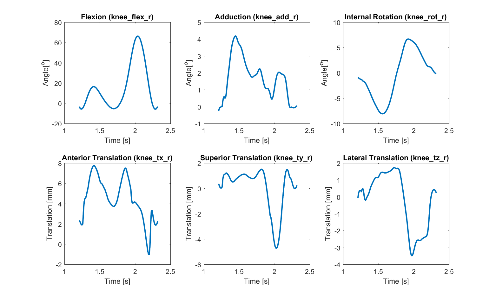
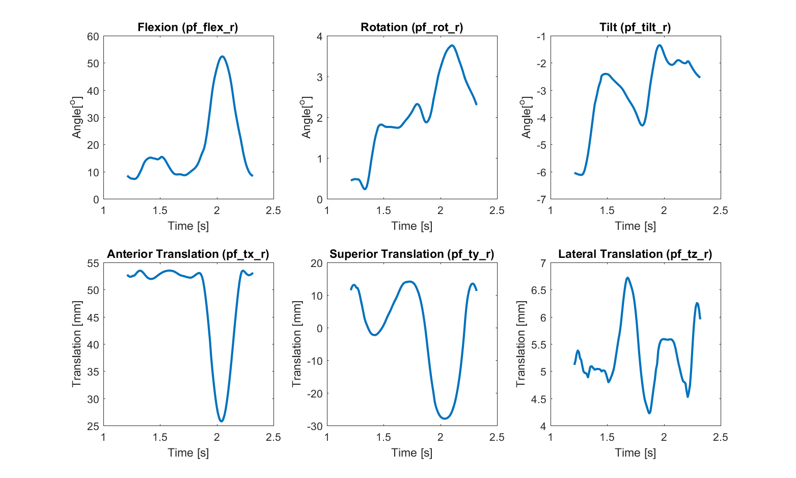
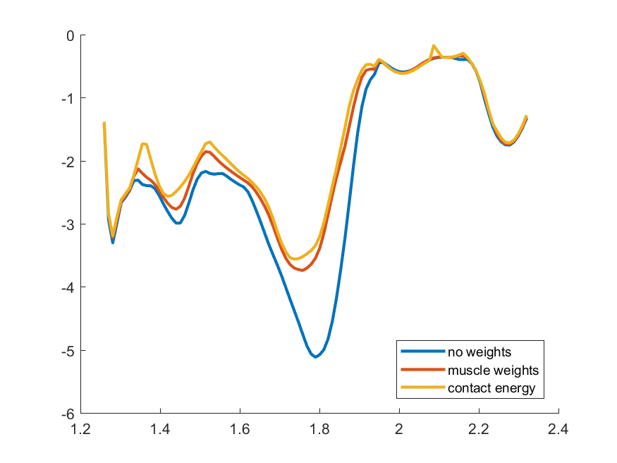
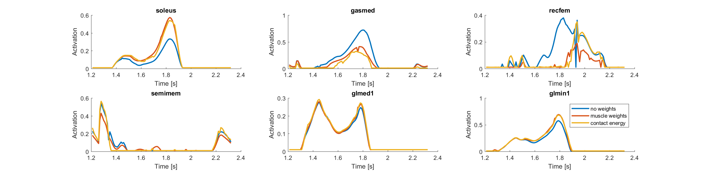

# Example: Walking

## Simulation Description
This example uses the COMAK to predict muscle forces, ligament forces, cartilage contact pressures, and secondary knee kinematics (5 tibiofemoral DOFs, 5 patellofemoral DOFs) during walking. 

The experimental data (motion capture, ground reaction forces) were collected while the Lenhart2015 subject performed overground walking at a self selected speed. 

Within COMAK it is important to define model coordinates as Primary, Secondary, and Prescribed. The Primary and the Prescribed coordinates must be quantifable using motion capture. In the COMAK optimization, a constraint equation is included for each Primary coordinate that dictates that the measured accelerations of the Primary coordinates 

__Primary Coordinates__
- hip_flex_r
- hip_add_r
- hip_rotation_r
- knee_flex_r
- ankle_flex_r

__Secondary Coordinates__
- knee_add_r
- knee_rot_r
- knee_tx_r
- knee_ty_r
- knee_tz_r
- pf_flex_r
- pf_rot_r
- pf_tilt_r
- pf_tx_r
- pf_ty_r
- pf_tz_r

__Prescribed Coordinates__
- All other model coordinates (pelvis, left leg, upperbody). 

__COMAKInverseKinematicsTool__
The COMAKInverseKinematicsTool is used to calculate the First, the COMAKInverseKinematics tool is used to perform a passive forward simulation where the knee flexion flexes from 0o to 120o and the Seconday Coordinates (listed below) are predicted based on the passive muscle, ligament, and articular contact forces. These simulation results are used to generate functions that couple the Secondary
  
## Simulation Results

  <b>Tibiofemoral Kinematics</b> 
    

  <b>Patellofemoral Kinematics</b> 
   

  <b>Tibia Axial Contact Force</b> 
   

  <b>Muscle Activations</b> 
   

  <b>Cartilage Contact Pressure</b> 
   

  <b>ACL and Patellar Tendon Force</b> 
   

## Workflow Steps
1) Inspect the [./inputs/comak_inverse_kinematics_settings.xml](./inputs/comak_inverse_kinematics_settings.xml) and [./inputs/comak_settings.xml](./inputs/comak_settings.xml) files to understand the inputs and settings for the simulation.

2) Inspect the [run_walking.cmd](run_walking.cmd) file.

3) Double click on the [run_walking.cmd](run_walking.cmd) file to perform the simulation.

4) Visualize the results in Paraview.

5) Use MATLAB to run analyze_walking_results.m to generate plots of the simulation results. 
